# Wayfarer — Architecture Summary

*Generated from a full inspection of the workspace at commit `3d14508` (branch `castle-fixed`), 2026-08-15.*

---

## 0. Reading note: how this document maps to the requested template

Wayfarer is **not** a web service. It is a single-binary, offline, native Windows game written in
C99 against a statically-linked, stripped-down SDL2. There is no server, no database, no network
stack, no package manager, and no third-party runtime. The requested section headings are therefore
mapped onto their real equivalents in this system:

| Requested concept | Equivalent in Wayfarer |
|---|---|
| Runtime / frameworks | C99 + MinGW-w64 GCC; SDL2 (video + audio subsystems only) |
| Libraries / dependencies | Exactly one: SDL2 2.32.10, rebuilt from source with most subsystems removed |
| Database | Two persistence surfaces: a **28-byte save file** (`wayfarer.sav`) and **201,531 bytes of compile-time-baked const sprite data** (`src/art_data.h`) |
| Data models / schemas | The C struct graph (`World`, `Game`, `Region`, `Entity`, `Building`, `Player`, `Synth`, …) and the binary save layout |
| API endpoints / routes | Three external interfaces: the **CLI argument surface**, the **keyboard input surface**, and the **process exit-code contract**. Internally, the module contracts between generation / simulation / render / audio |
| Auth requirements | Gate conditions on each interface: shipping-build availability, `WAYFARER_SELFTEST` compile gate, and in-game progression gates (abilities, shards, castle key) |
| Third-party services | None. Zero network calls, zero telemetry, zero external file reads beyond the save file |

Everything below is derived from the source, not from the README. Where the two disagree, the
source is treated as authoritative and the discrepancy is flagged (see
[§10 Documentation discrepancies](#10-documentation-discrepancies-found-during-this-pass)).

---

## Contents

- [1. System overview](#1-system-overview)
- [2. Tech stack](#2-tech-stack)
- [3. Repository & build topology](#3-repository--build-topology)
- [4. Data models, schemas and entity relationships](#4-data-models-schemas-and-entity-relationships)
- [5. Persistence formats](#5-persistence-formats)
- [6. Core business logic flows](#6-core-business-logic-flows)
- [7. Key service modules](#7-key-service-modules)
- [8. Interface surface ("API endpoints")](#8-interface-surface-api-endpoints)
- [9. Cross-cutting invariants](#9-cross-cutting-invariants)
- [10. Documentation discrepancies found during this pass](#10-documentation-discrepancies-found-during-this-pass)

---

## 1. System overview

Wayfarer is an exploration/memory-restoration game built for the *2P Game Arcade "1.44 MB Floppy
Disk"* contest. The binding constraint is that the fully-decompressed, runnable `.exe` must fit on
a floppy disk (≤ 1,474,560 bytes) and ship **zero external asset files** — every sprite, glyph,
sound and note of music is either generated procedurally at runtime or baked into the binary at
compile time.

The consequence that shapes the entire architecture: **the whole program is one translation unit**
([src/main.c](../src/main.c), 14,049 lines) plus one machine-generated header
([src/art_data.h](../src/art_data.h), 12,912 lines). There is no engine, no scene graph, no
component system, and no dynamic allocation on any hot path.

### 1.1 Top-level architecture

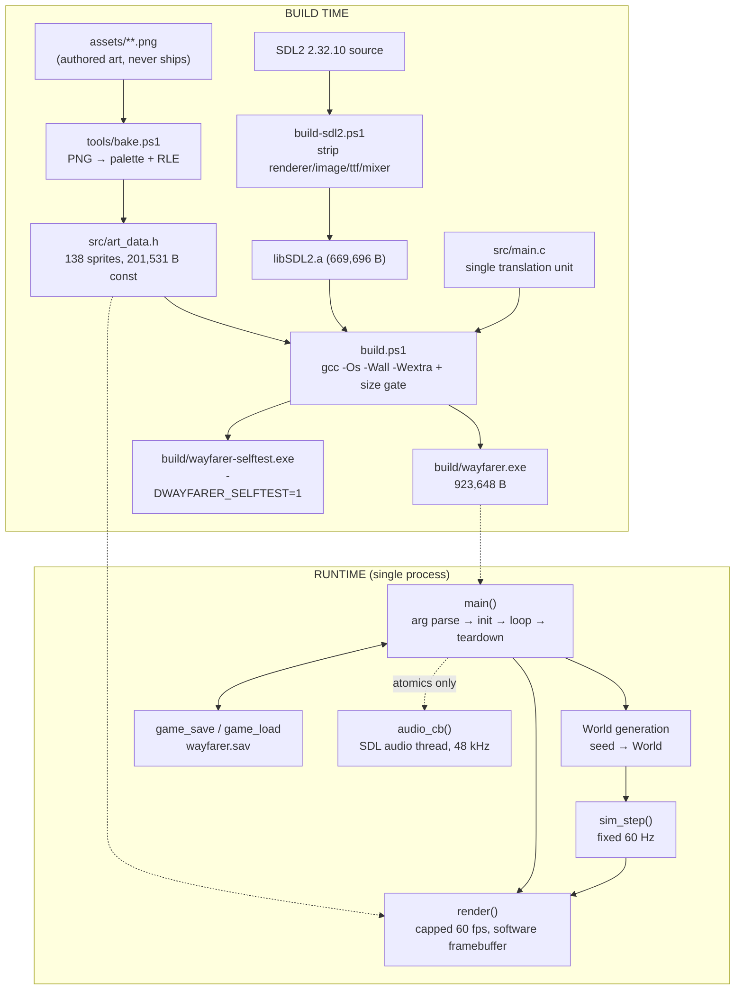

### 1.2 Threading model

Exactly two threads, with a deliberately minimal interface between them:

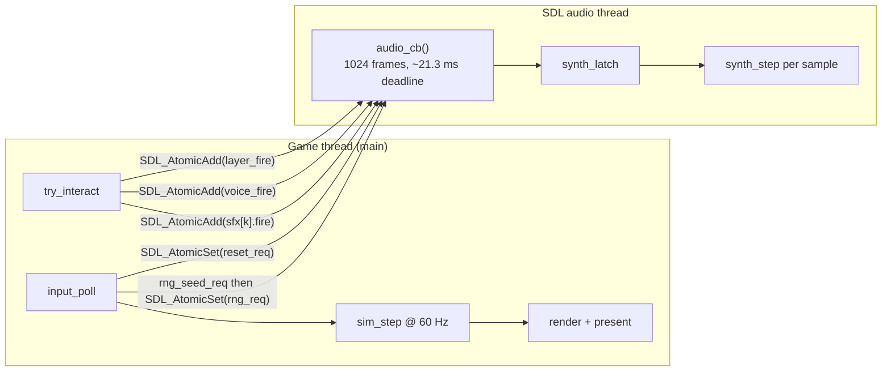

The game thread writes **only** `SDL_atomic_t` fields (`layer_fire`, `voice_fire`, `reset_req`,
`rng_req`) plus one payload (`rng_seed_req`, written *before* its flag). Every other byte of
`Audio`/`Synth` state is owned exclusively by the callback. The callback never allocates, never
locks, and never blocks. Measured worst case: 0.079–0.325 ms against a 21.333 ms deadline.

### 1.3 Frame / tick pipeline

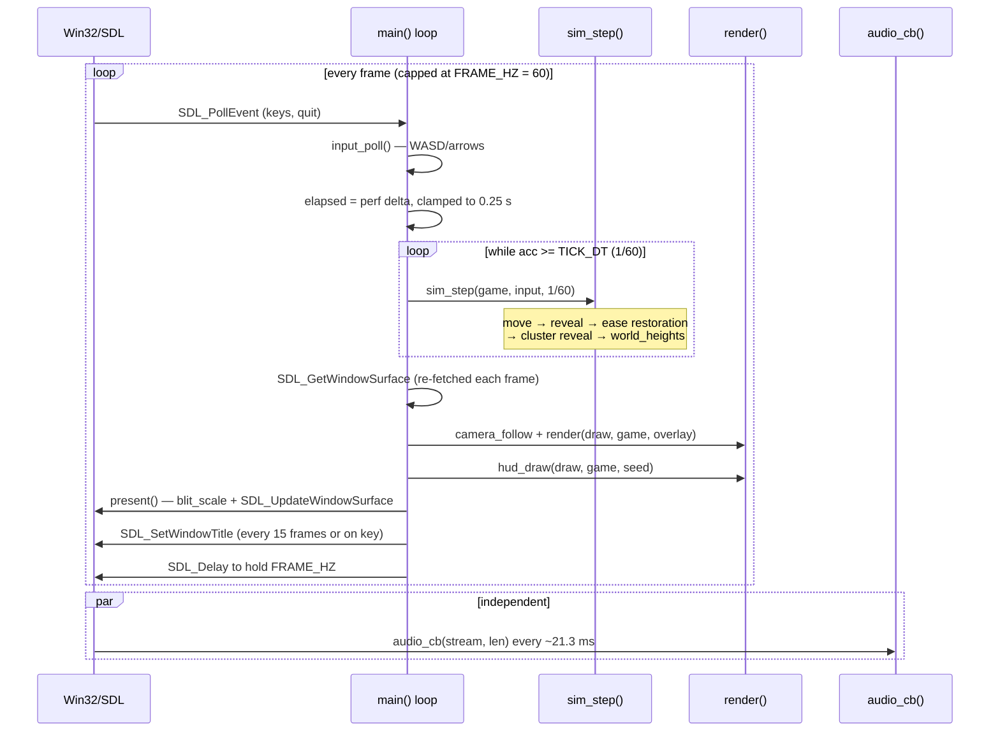

Simulation is **fixed-step** and decoupled from rendering: the frame cap changes only how often the
screen is redrawn, never how the world advances. This is what makes headless playthrough tests
(`--play-test`) produce identical results to real play.

---

## 2. Tech stack

### 2.1 Runtime & language

| Layer | Choice | Detail |
|---|---|---|
| Language | **C99** | `-std=c99`, compiles clean under `-Wall -Wextra` with zero warnings |
| Compiler | **GCC 16.1.0** via [w64devkit](https://github.com/skeeto/w64devkit) v2.9.0 (MinGW-w64) | Lives outside the repo at `$env:WAYFARER_TOOLS` (default `G:\tools`) |
| Optimisation | `-Os` | Size over speed; **no LTO** (w64devkit's gcc is built without LTO support) |
| Section flags | `-ffunction-sections -fdata-sections` + `-Wl,--gc-sections` | Dead-code elimination at link time |
| Byte-shaving | `-fno-ident`, `-fno-asynchronous-unwind-tables`, `-s` (strip) | |
| Linkage | `-static` | No shipped DLLs beyond what Windows itself provides |
| Subsystem | `-mwindows` (shipping) / `-mconsole` (self-test) | Shipping binary has **no stdout/stderr at all** |
| Target OS | Windows x64 | Verified on Windows 11 Pro 10.0.26200 only |

### 2.2 Third-party libraries — complete list

| Library | Version | Licence | How it is used |
|---|---|---|---|
| **SDL2** | 2.32.10 | zlib | The only dependency. Statically linked, rebuilt from source by `build-sdl2.ps1` with unused subsystems removed. Official prebuilt `libSDL2.a` was 1,656,876 B — over budget before a line of game code. The rebuild is **669,696 B**. |

**Deliberately excluded**: `SDL_image`, `SDL_ttf`, `SDL_mixer`, and SDL's own *render* subsystem
(`SDL_Renderer`, and with it `PRESENTVSYNC`), controller mapping database, and most render backends.

SDL surface used by the game, in full:

- `SDL_Init(SDL_INIT_VIDEO)` / `SDL_InitSubSystem(SDL_INIT_AUDIO)` — deliberately **separate calls**
  so a machine with no sound device still launches ([src/main.c:13618-13664](../src/main.c#L13618-L13664))
- `SDL_CreateWindow` / `SDL_GetWindowSurface` / `SDL_UpdateWindowSurface` / `SDL_SetWindowFullscreen` / `SDL_SetWindowTitle`
- `SDL_CreateRGBSurface`, `SDL_CreateRGBSurfaceWithFormatFrom`, `SDL_BlitSurface`, `SDL_MapRGB`, `SDL_SaveBMP` (self-test only)
- `SDL_OpenAudioDevice` / `SDL_PauseAudioDevice` / `SDL_CloseAudioDevice`
- `SDL_GetKeyboardState`, `SDL_PollEvent`
- `SDL_atomic_t` + `SDL_AtomicGet/Set/Add`
- `SDL_GetPerformanceCounter` / `SDL_GetPerformanceFrequency` / `SDL_Delay`
- `SDL_RWFromFile` / `SDL_RWread` / `SDL_RWwrite` / `SDL_RWclose`
- `SDL_malloc` / `SDL_free` / `SDL_memcpy` / `SDL_memset` / `SDL_zero` / `SDL_snprintf` / `SDL_strcmp` / `SDL_atoi`
- `SDL_sinf`, `SDL_sqrtf`, `SDL_fabsf`, `SDL_floorf`

### 2.3 Hand-rolled subsystems (everything the excluded libraries would have provided)

| Subsystem | Implementation | Location |
|---|---|---|
| Rendering | Software framebuffer; isometric per-column span rasteriser; no z-buffer, no GPU | `render`, `iso_tile`, `vspan`, `fill_rect` |
| Upscale / present | Integer nearest-neighbour scale from a 960×540 heap backbuffer to the window | `blit_scale`, `present`, `backbuffer_new` |
| Font | Hand-rolled 5×7 bit-packed bitmap font, 91 glyphs (`0x20`–`0x7A`) | `draw_glyph`, `draw_text`, `draw_text_shadow` |
| Sprite decode | Per-sprite 8-bit palette + RLE, decoded straight to the framebuffer | `draw_sprite_ex`, `art_palette` |
| Audio synthesis | 5-layer deterministic softsynth + 3 parametric SFX voices | `synth_step`, `wave_sample`, `audio_cb` |
| RNG | PCG32 with independent stream selectors | `rng_next`, `rng_seed`, `rngs_init` |
| Serialisation | Hand-written little-endian byte packing | `save_put32/64`, `save_get32/64` |
| Test harness | 27 self-test entry points with negative controls, in the same file | `#if WAYFARER_SELFTEST` block, lines 8073–13732 |

### 2.4 Build & tooling scripts

| Script | Purpose |
|---|---|
| [build.ps1](../build.ps1) | Release/self-test build, size measurement, **budget gate** (exits 2 over hard limit, 3 over ship target) |
| [build-sdl2.ps1](../build-sdl2.ps1) | Builds the cut-down static SDL2 into `$TOOLS\SDL2-min` |
| [tools/bake.ps1](../tools/bake.ps1) | PNG → `src/art_data.h`. Key-magenta stripping, opaque-box trim, per-sprite palette, RLE, dream-realm recolour, contact-sheet warning |
| [tools/run-tests.ps1](../tools/run-tests.ps1) | Runs all 27 self-tests plus a size-budget assertion in one pass. Auto-builds stale binaries, times each test, exits with the **number of failures** (`99` = build failed). `-NoBuild`, `-Quick`, `-Filter` |
| [Wayfarer-DEV.bat](../Wayfarer-DEV.bat) | Launches `wayfarer.exe --dev` |
| [compile_commands.json](../compile_commands.json) | clangd/IntelliSense database (single entry) |
| [.vscode/c_cpp_properties.json](../.vscode/c_cpp_properties.json) | VS Code C/C++ config, hardcoded `G:/tools` paths |

**There is no CI *service* wired to this repository** — no `.github/`, no `.gitlab-ci.yml`, nothing
runs on push. What exists instead is a local runner: `.\tools\run-tests.ps1` builds whatever is stale
and executes the whole suite in one command, so the "all green" claim is a property anyone can check
against the working tree rather than a hand-recorded result from a past moment. Invoking it is still
a manual act.

---

## 3. Repository & build topology

```
Wayfarer/
├── src/
│   ├── main.c            14,114 lines — the entire game
│   └── art_data.h        12,912 lines — GENERATED, committed, never hand-edited
├── tools/
│   ├── bake.ps1          PNG → art_data.h bake pipeline
│   └── run-tests.ps1     whole self-test suite + size gate, one exit code
├── assets/               source art; bake inputs only, nothing here ships
│   ├── buildings/  castle/  dark_fantasy/  magical/  nature/  player_new/
├── archive/              superseded design docs, 30+ devlog sessions, process notes
│   ├── design/{phases,systems}/
│   └── devlog/
├── build/                gitignored — binaries, .last_size, screenshot BMPs
├── docs/                 ← this document
├── build.ps1  build-sdl2.ps1  Wayfarer-DEV.bat  README.md
└── compile_commands.json  .gitignore  .gitattributes
```

### 3.1 The two-binary model

The single most important build-level decision: **the self-test harness is not a runtime flag.**

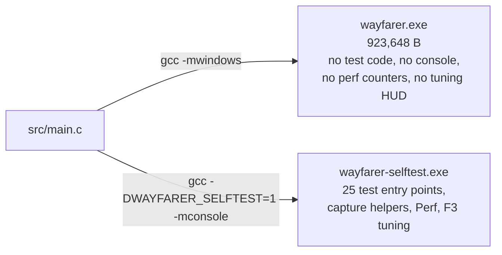

`WAYFARER_PERF` defaults to `WAYFARER_SELFTEST` ([src/main.c:33-35](../src/main.c#L33-L35)), so
performance instrumentation is likewise absent from the shipping binary. This makes "no debug code
in the submission" a *structural* guarantee — but it also means the shipping binary has zero
runtime diagnostics of any kind (see the gap analysis).

### 3.2 Size budget enforcement

`build.ps1` records the previous size in `build/.last_size` and prints a delta on every build:

| Threshold | Bytes | Behaviour |
|---|---|---|
| `$WARN` | 1,200,000 | Yellow warning, build succeeds |
| `$TARGET` (ship) | 1,440,000 | **exit 3** |
| `$HARD` (floppy standard) | 1,474,560 | **exit 2** |
| Current | **923,648** | 516,352 B headroom under ship target |

Self-test builds are explicitly excluded from budget tracking (`exit 0` before the size file is
touched).

---

## 4. Data models, schemas and entity relationships

### 4.1 Entity-relationship overview

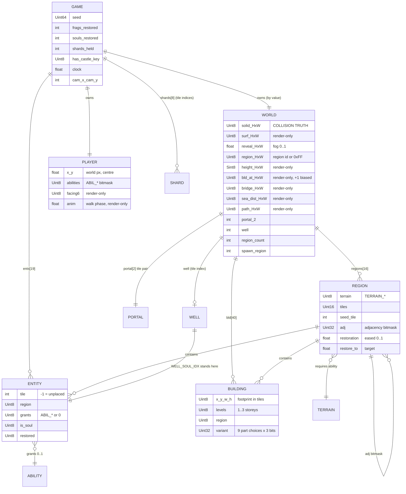

### 4.2 World grid geometry

| Constant | Value | Meaning |
|---|---|---|
| `WORLD_W` | 164 | tiles |
| `WORLD_H` | 157 | tiles (= `DREAM_Y0 + DREAM_H`) |
| Grid area | **25,748 tiles** | every per-tile array is this size |
| `TILE` | 18 | world px per tile |
| `OVERWORLD_H` | 91 | overworld = rows 0–90 |
| `DREAM_GAP` | 6 | rows 91–96, **always solid** — the void band |
| `DREAM_Y0` | 97 | dream archipelago = rows 97–156 |
| `DREAM_H` | 60 | |
| `LOGICAL_W × LOGICAL_H` | 960 × 540 | render resolution, integer-upscaled to the window |
| `WIN_SCALE_MAX` | 3 | max integer window scale |

Three landmasses share **one** grid and **one** collision rule:

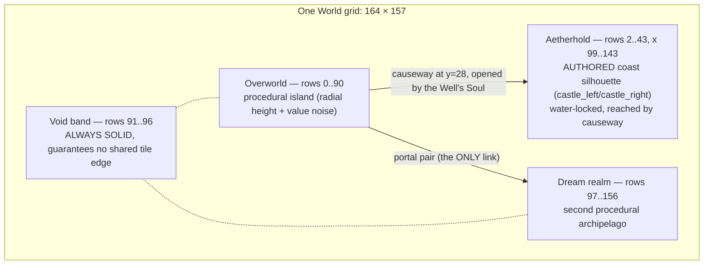

- `dream_sector(ty)` (`ty >= DREAM_Y0`) is the *one* predicate that knows where the dream boundary is.
- `castle_island_tile(tx,ty)` is the one predicate that knows the Aetherhold footprint, derived from
  two hand-authored 42-entry span tables (`castle_left[]`, `castle_right[]`).
- `castle_tier(tx,ty)` — `min(castle_inset, keep hill)` — is the *single* source of truth for
  terraces, wall rings, stairs, ground palette and decoration. Both inputs are 1-Lipschitz, so the
  tier provably never steps two levels between adjacent tiles (asserted by `--aether-test`).

### 4.3 Enumerations and their cardinality ceilings

| Enum | Values | Structural ceiling |
|---|---|---|
| `TERRAIN_*` | `NORMAL`, `WATER`, `LEDGE`, `DARK` | `terrain_requires[]` maps each to `ABIL_NONE / WADE / CLIMB / KINDLE` |
| `ABIL_*` | `WADE` (1), `CLIMB` (2), `KINDLE` (4) | One `Uint8` bitmask; 3 abilities is the entire ability system |
| `SURF_*` | `LAND`, `ROCK`, `OCEAN`, `RIVER` | Render-only; collision never reads `surf[][]` |
| `FACE6_*` | `DOWN`, `RIGHT_DOWN`, `RIGHT_UP`, `UP`, `LEFT_UP`, `LEFT_DOWN` | Render-only screen-space facing |
| `PROP_*` | `NONE`, `TREE`, `BUSH`, `ROCK`, `REED`, … | Stateless, drawn from `tile_hash` |
| `LAYER_*` | `BASE`, `STRINGS`, `PAD`, `BELLS`, `VOICE` | `NUM_LAYERS = 5` |
| `SFX_*` | `CHIME`, `SHARD`, `PORTAL` | `NUM_SFX = 3` |
| `WELL_*` | `EMPTY`, `PARTIAL`, `FULL` | Pure function of `shards_held` |
| `CT_*` (castle tier) | `SEA`, `SHORE`, `OUTER`, `INNER`, `UPPER`, `KEEP` | `CT_COUNT = 6` |

### 4.4 Hard structural ceilings

These are load-bearing and must not be exceeded without a format change:

| Ceiling | Value | Enforced by |
|---|---|---|
| `FRAGMENT_COUNT + SOUL_COUNT` | 14 + 5 = **19**, must stay ≤ **32** | `Uint32` restored bitmask in the save format |
| `REGION_COUNT` | **16**, capped at 32 | `Uint32 adj` adjacency bitmask in `Region` |
| `BUILDING_MAX` | **40**, capped at 255 | `Uint8 bld_at[][]` (stored +1, so 0 = none) |
| `SHARD_COUNT` | **8**, capped at 8 | `Uint8` shard mask at save byte 21 |
| Tile draw height | ±127 px | `Sint8 height[][]` |
| `sizeof(World) + sizeof(Scratch)` | **670,272 B**, must be < 700 × 1024 | Compile-time `wayfarer_stack_guard` typedef → build fails otherwise |

### 4.5 Memory footprint (computed)

| Structure | Size | Notes |
|---|---|---|
| `World` | ≈ **309,800 B** (302 KB) | 8 × `Uint8[25748]` + `float reveal[25748]` (102,992 B) + regions/buildings/scalars |
| `Scratch` | ≈ **360,472 B** (352 KB) | `seen` + `owner` (Uint8) + `stack`/`queue`/`dist` (int) — generation only, always a stack local |
| `Game` | ≈ **310,136 B** | `World` + `Player` + `ents[19]` + counters + shard state + reveal animation state |
| `Region` | 20 B | × 16 |
| `Entity` | 8 B | × 19 |
| `Building` | 12 B | × 40 |
| `Player` | 16 B | |
| `ArtSprite` | 20 B | × 138 in `.rdata` |
| Backbuffer | 2,073,600 B | 960 × 540 × 4, heap, zero exe bytes |
| Minimap cache | 25,748 B | `hud.mm`, 1 px per tile |

**Never `static`**: `World` and `Scratch` are always function locals. A file-scope instance would
land in `.data`/`.bss` COMDAT and cost shipped bytes — the "`.data` trap" the comments repeatedly
reference. `game_load` and every self-test that needs a second `Game` uses `SDL_malloc` instead.

### 4.6 The render-only / collision-truth partition

This is the single most important schema-level invariant in the codebase.

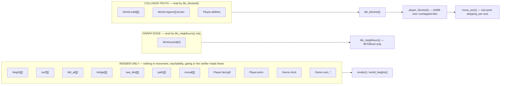

Because collision reads *only* `solid` and `regions[].terrain`, every completability proof after a
generation change is a **re-run**, not a re-argument. Bridges are made walkable by *clearing*
`solid` rather than by adding a second collision input; paths are ordinary open ground; the portal
is an interact, not a movement.

---

## 5. Persistence formats

### 5.1 Save file — `wayfarer.sav`, 28 bytes, version 2

Written by `game_save` ([src/main.c:4299](../src/main.c#L4299)), read by `game_load`
([src/main.c:4351](../src/main.c#L4351)). All multi-byte fields are **little-endian, written by
hand** so no struct padding or host endianness leaks into the file.

| Offset | Size | Field | Type | Validation on load |
|---|---|---|---|---|
| 0 | 1 | magic[0] | `'W'` | must equal `'W'` |
| 1 | 1 | magic[1] | `'F'` | must equal `'F'` |
| 2 | 1 | version | `Uint8` | must be `1` or `2` (`SAVE_VERSION`) |
| 3 | 1 | reserved | `0` | must be `0` |
| 4 | 8 | seed | `Uint64` LE | *(unvalidated — any value regenerates a world)* |
| 12 | 4 | player.x | `float` LE bit pattern | `>= 0` (rejects NaN), `< WORLD_W*TILE` |
| 16 | 4 | player.y | `float` LE bit pattern | `>= 0` (rejects NaN), `< WORLD_H*TILE` |
| 20 | 1 | abilities | `Uint8` bitmask | no bits outside `WADE\|CLIMB\|KINDLE` |
| 21 | 1 | shard mask | `Uint8` | no bits ≥ `SHARD_COUNT` |
| 22 | 1 | has_castle_key | `Uint8` | v1: must be `0`; v2: must be `≤ 1` |
| 23 | 1 | reserved | `0` | must be `0` |
| 24 | 4 | restored mask | `Uint32` LE | no bits ≥ `ENTITY_COUNT` |

**What is deliberately *not* saved**, and why:

| Omitted | Rebuilt how |
|---|---|
| `reveal[][]` (102,992 B of float) | Recomputed as one instant of standing at the saved position — the same taper `reveal_around` converges to |
| `regions[].restoration` (eased float) | Snapped to `restore_to`; mid-ease values are animation, not progress |
| Terrain, buildings, rivers, entities, shard positions | **Regenerated from the seed.** The world is a pure function of its seed |
| `facing6`, `anim`, camera, `clock` | Render-only |

### 5.2 Load sequence — validation-first

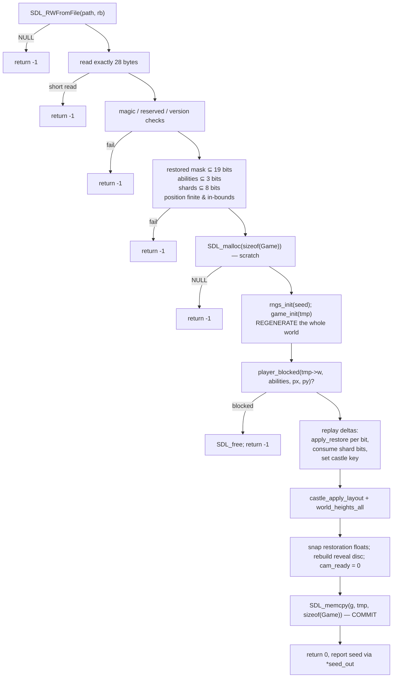

Every failure path returns **before the live game is touched**. Five negative controls in
`--save-test` cover truncated file, wrong version, bad magic, out-of-bounds position, and missing
file. This is the only place in the entire program where outside input reaches program state, and
it is the most carefully validated code in the file.

### 5.3 Baked art — `src/art_data.h`

The second persistence surface: a compile-time database of sprites.

| Constant | Value |
|---|---|
| `ART_SPRITE_COUNT` | **138** |
| `ART_PAL_BYTES` | **11,154** (3 bytes per palette entry) |
| `ART_DATA_BYTES` | **190,377** (RLE index stream) |
| Descriptor table | 138 × 20 B `ArtSprite` records |

`ArtSprite` schema:

```c
typedef struct {
    unsigned short w, h;                /* trimmed to the opaque bounding box */
    unsigned short anchor_x, anchor_y;  /* ground-contact point: bottom-centre */
    unsigned short pal_off, pal_n;      /* slice of ART_PAL */
    unsigned int   data_off, data_len;  /* slice of ART_DATA */
} ArtSprite;
```

**RLE encoding**, control byte `C`:

| Control byte | Meaning |
|---|---|
| `C < 0x80` | RUN of `C + 1` pixels; the next byte is the palette index |
| `C >= 0x80` | LITERAL of `(C & 0x7F) + 1` pixels; that many index bytes follow |

Palette index **0 is always transparent** and is never a real colour, which makes the alpha test
free at decode time. Palettes are per-sprite and **unquantised** — measured 7–49 colours per sprite
(mean 18), so 4-bit indices were never viable.

Bake pipeline invariants (`tools/bake.ps1`):

1. Strips a known key-magenta background (4 measured colours; the same 4 are duplicated in `main.c`
   and kept in sync **by test** — `--sprite-test` fails if one reaches a baked palette).
2. Trims to the opaque bounding box (71% of authored canvas area is transparent).
3. Prints the **key-colour strip count per sprite** — a quiet zero is the failure mode.
4. Warns on **contact sheets** (multiple objects on one canvas) by counting disjoint opaque column
   groups — this defect once shipped `stairs_platforms_1.png` as the causeway's deck tile.
5. Dream-realm variants are *not* re-authored: `dream_shift()` recolours by luminance alone. The C
   and PowerShell implementations are checked against each other by `--sprite-test` so they cannot
   drift. A biome variant costs ~70 bytes of palette instead of ~1.7 KB of sprite.
6. **Only sprites with an actual caller in `main.c` are baked.** The Aetherhold rebuild found 39
   caller-less baked sprites costing ~210 KB.

---

## 6. Core business logic flows

### 6.1 World generation — generate-then-verify

The central architectural pattern: reachability is **enforced**, not hoped for.

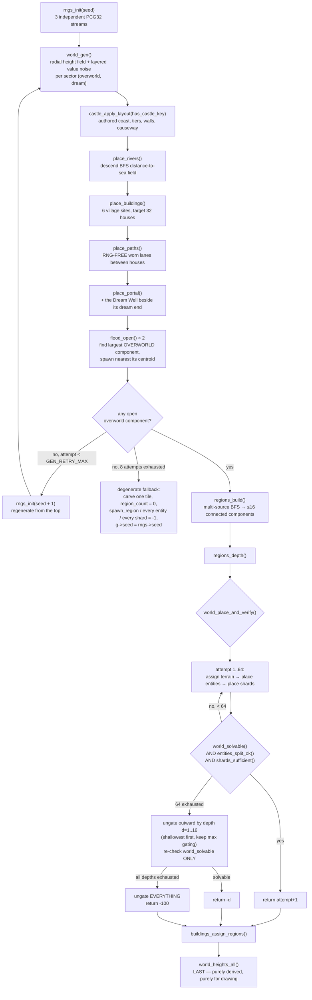

**Why rivers descend the sea-distance field and not the height field**: the height field has local
minima, so a downhill walk can trap; a BFS distance field structurally cannot, so the walk provably
terminates at water.

**Why the ungating fallback exists**: `design/Cut List.md` is explicit that the reachability
guarantee is the one thing that must never be traded. A world with a thin dream realm still ships;
an unwinnable one does not. The fallback deliberately does *not* re-check `entities_split_ok` or
`shards_sufficient`.

**Why the seed retry is a loop and not recursion** (ERR-1): `Scratch sc` is a ~360 KB stack local.
A recursive `game_init` would put a second `Scratch` *and* the caller's `World` on one frame —
roughly 1.03 MB against MinGW's 2 MB default, which is the exact term invariant 2 exists to bound.
The `for` loop reuses the one frame and costs 4 bytes of `int`. The step is `seed + 1`, deliberately
the same step the `R` key takes, so a player walking past a pathological seed and `game_init`
stepping past it internally land on the same world — one rule, not two. `main` resyncs its own
`seed` from `rngs.seed` afterwards, because that variable is what the HUD and title bar display and
its whole value is that `--seed N` reproduces what is on screen.

### 6.2 The core game loop — explore → restore → awaken → remember

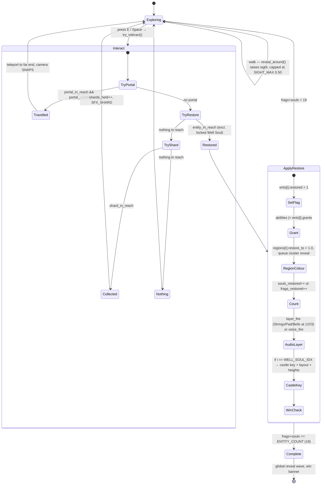

### 6.3 Progression gating — the dependency chain

```mermaid
flowchart LR
    START["spawn (overworld, no abilities)"] --> F1["fragment 0 → WADE"] --> W["TERRAIN_WATER regions open"]
    W --> F2["fragment 1 → CLIMB"] --> L["TERRAIN_LEDGE regions open"]
    L --> F3["fragment 2 → KINDLE"] --> D["TERRAIN_DARK regions open"]
    D --> POR["portal usable<br/>(requires standing ON the end)"]
    POR --> DREAM["dream realm:<br/>4 fragments + 2 souls + 8 shards"]
    DREAM --> SH["collect ≥ 6 of 8 shards"]
    SH --> WELL["Well's Soul becomes redeemable<br/>(pure function of shards_held)"]
    WELL --> KEY["has_castle_key = 1<br/>castle_apply_layout(1) + castle_apply_heights"]
    KEY --> AETHER["Aetherhold causeway opens<br/>sea gate at (100, 28)"]
    AETHER --> WIN["restore all 19 entities → Fully Restored"]
```

The three ability grants (`ents[0..2]`) are **enforced** to be in the overworld: some regions are
exempt from gating (depth ≤ 1, and the dream arrival region always), and the portal is an ordinary
region-graph edge, so an unfiltered `reach` really can offer a dream region. Placement filters by
`over_mask` with a two-tier fallback.

The Well's Soul (`ents[14]`, `WELL_SOUL_IDX`) is an **ordinary** entity for the region graph, the
restored mask, `world_solvable` and `game_complete`. It differs only in `entity_in_reach`, which
excludes it while `shards_held < SHARD_REQUIRED`. Redeemability is a *pure function*, not a stored
lock bit — nothing can go stale.

### 6.4 Fog and reveal — one path from surface colour to screen colour

`fog_lerp()` is the *single* funnel. Every tile face, cliff face, tree lobe and baked-sprite palette
goes through it exactly once. The on-screen reveal for a tile is the **stronger** of two
contributions:

| Contribution | Source | Cap | Persistence |
|---|---|---|---|
| Sight | `reveal_around()` — 19×19 tile disc around the player, `REVEAL_RATE 2.5`/s | `SIGHT_MAX` = **0.50** | Permanent once raised, but never reaches 1.0 |
| Restoration | `regions[].restoration`, eased at `RESTORE_RATE 0.9`/s toward `restore_to` | 1.0 | Permanent, region-wide |

It resolves toward a *light, cool haze* (`FOG_TINT` 60/70/86) that keeps a fixed fraction
(`FOG_KEEP` = 0.50) of the source's own luminance contrast — deliberately not a dark grey, because
a dark blend was the measured cause of an early "traversal feels suffocating" read.

### 6.5 Isometric rendering pipeline

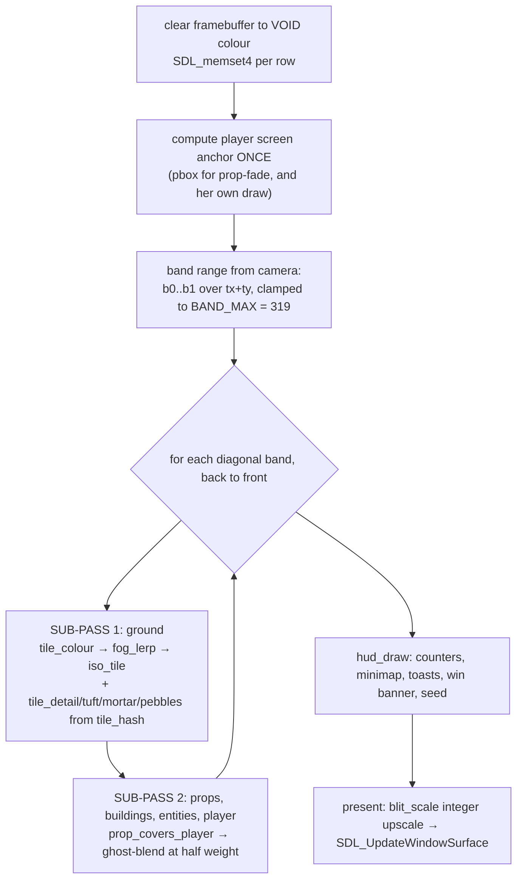

Key properties:

- **Projection collapses to one subtract and one halve**: `sx = wx - wy + ISO_OX`,
  `sy = (wx + wy)/2 + ISO_OY`, exact on integers because tile half-width = `TILE` and half-height =
  `TILE/2`.
- **Per-column spans, not scanline diamonds**: for column `i`, `a = |i - ISO_HW|` is the exact
  preimage of the tile under the inverse projection. This makes tiling *provably* gap-free.
  Elevation extends the same column rather than needing a second edge computation, so there is no
  second code path that could disagree with the first.
- **Two sub-passes per band** because a tall prop can spill onto the tile to its right within the
  same band. No z-buffer exists.
- **Decoration is drawn from `tile_hash(seed, tx, ty)`** — a stateless finisher deliberately *not*
  drawn from the terrain/entity/audio RNG streams, so decoration can never perturb generation and
  every seeded test result stays valid by construction.
- **Buildings are never hand-drawn as walls**: footprint tiles get a wall height from
  `world_heights`, and the ordinary tile rasteriser's front-face extrusion *is* the wall. Roofs are
  stacked shrinking diamonds from the front-most corner.

Derived geometry constants (at `TILE 18`):

| Constant | Expression | Value |
|---|---|---|
| `ISO_HW` / `ISO_HH` | `TILE` / `TILE/2` | 18 / 9 |
| `DIA_W` / `DIA_H` | `2*ISO_HW` / `2*ISO_HH` | 36 / 18 |
| `ISO_OX` | `WORLD_H * TILE` | 2,826 |
| `ISO_MAP_W` / `ISO_MAP_H` | `(WORLD_W+WORLD_H)*TILE` / half | 5,778 / 2,889 |
| `BAND_MAX` | `WORLD_W + WORLD_H - 2` | 319 |
| `ELEV_MAX` / `ELEV_STEP` | `PX(48)` / `PX(12)` | 27 / 7 px |
| `PLAYER_SIZE` / `PLAYER_SPEED` | `PX(24)` / `PXF(220)` | 14 px / 123.75 world px/s (≈ 6.9 tiles/s) |
| `INTERACT_RADIUS` / `PORTAL_REACH` | `PXF(44)` / `PXF(34)` | 24.75 / 19.125 world px |

The `PX(n)` / `PXF(n)` macros express every pixel measurement as a fraction of a reference
`TILE_REF 32`, so changing `TILE` rescales the whole game consistently and collision stays unchanged
in tile terms.

### 6.6 Audio synthesis

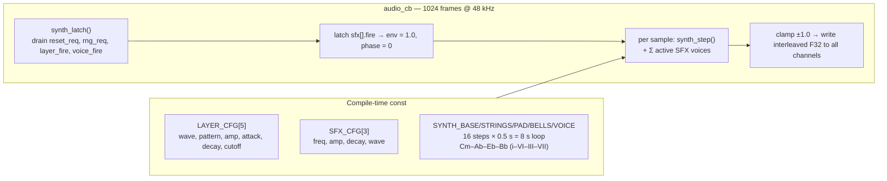

| Layer | Waveform | Gate | Amp | Character |
|---|---|---|---|---|
| `BASE` | saw | always on | 0.30 | C2 drone (65.41 Hz), legato |
| `STRINGS` | saw | fragment count ≥ 1 | 0.16 | 16-step arpeggio |
| `PAD` | sine | fragment count ≥ 2 | 0.13 | root notes, legato swell |
| `BELLS` | sine | fragment count ≥ 3 | 0.16 | plucks, decay 1.5 |
| `VOICE` | sine | any Found Soul restored | 0.20 | Voice of Souls melody |

| SFX | Frequency | Wave | Fired by |
|---|---|---|---|
| `CHIME` | 660 Hz | sine | fragment/soul restore, F12 dev unlock |
| `SHARD` | 1318 Hz | sine | dream shard pickup |
| `PORTAL` | — | noise | portal travel |

Every voice is a **pure function of a sample counter**, so two fresh states produce bit-identical
96,000-sample streams — proven by `--audio-test`, not assumed. Format is `AUDIO_F32SYS` stereo at
48 kHz with only `SDL_AUDIO_ALLOW_FREQUENCY_CHANGE` permitted, so SDL never inserts a converter.

---

## 7. Key service modules

`src/main.c` is one file, but it is organised into clearly delimited sections. Line numbers are from
the current commit.

| # | Module | Lines | Public contract |
|---|---|---|---|
| 1 | **Constants & geometry** | 17–160 | `LOGICAL_*`, `TILE`, `WORLD_*`, `DREAM_*`, `CASTLE_*`, `castle_left/right[]` |
| 2 | **Aetherhold predicates** | 164–521 | `castle_island_tile`, `castle_inset`, **`castle_tier`**, `castle_approach_tile`, `castle_causeway_tile`, `castle_proc_*`, `castle_rim_tile`, `castle_wall_tile`, `castle_stair_tile`, `castle_path_tile`, `castle_bld_at/covers`, `is_castle_reserved` |
| 3 | **Scale & fog tuning** | 523–610 | `PX`/`PXF`, `PLAYER_SIZE`, `REVEAL_*`, `FOG_*`, `FogTune` |
| 4 | **Isometric constants** | 612–684 | `ISO_*`, `ELEV_*`, `FACE_L/R`, `ROOF_L`, `TICK_HZ`, `CAM_*`, `AUDIO_*` |
| 5 | **Synth tables** | 686–784 | `Wave`, `LAYER_CFG[5]`, `SFX_CFG[3]`, `Voice`, `Synth` |
| 6 | **RNG** | 786–877 | `Rng`, `rng_next/seed/float/bipolar/below`, `Rngs`, `rngs_init`, `STREAM_TERRAIN/ENTITIES/AUDIO` |
| 7 | **Audio** | 879–1141 | `Audio`, `wave_sample`, `sfx_fire`, `synth_latch`, `synth_step`, `audio_cb`, `audio_open` |
| 8 | **Args** | 1143–1167 | `arg_val`, `arg_int`, `arg_flag` |
| 9 | **World & region schema** | 1169–1501 | `Region`, `Entity`, `Building`, `World`, `Scratch`, `Player`, `Game`, `Input`, `solid_at` |
| 10 | **Island generation** | 1503–1673 | `land_lattice`, `land_noise`, `gen_sector`, `world_gen` |
| 11 | **Castle layout** | 1674–1991 | `castle_apply_layout`, `castle_apply_heights` |
| 12 | **Rivers & bridges** | 1992–2150 | `place_rivers` |
| 13 | **Villages & paths** | 2151–2356 | `place_buildings`, `place_paths` |
| 14 | **Region graph** | 2369–2633 | `portal_link`, `tile_neighbours`, `bfs_open`, `regions_build`, `regions_depth`, `buildings_assign_regions`, `regions_assign_terrain` |
| 15 | **Reachability invariant** | 2634–3105 | **`regions_reachable`**, **`world_solvable`**, `pick_region`, `pick_tile_in_region`, `regions_by_sector`, `place_entities`, `entities_split_ok`, `place_shards`, `shards_sufficient`, **`world_place_and_verify`** |
| 16 | **Collision & movement** | 3107–3206 | **`tile_blocked`**, `player_blocked`, `move_axis`, `reveal_around`, `input_poll` |
| 17 | **Interaction & progression** | 3208–3476 | `portal_in_reach`, `portal_usable`, `try_portal`, `entity_in_reach`, `shard_in_reach`, `try_collect_shard`, `castle_bridge_open`, **`apply_restore`**, `try_restore`, `dev_unlock_all`, `game_complete`, `world_stage` |
| 18 | **Simulation** | 3477–3643 | **`sim_step`** |
| 19 | **Heights & building art seam** | 3652–4103 | `flood_open`, `bld_phase`, `building_restoration`, **`building_sprite_id`**, `world_heights`, `world_heights_all`, `height_at`, `biggest_component_tile`, `place_portal` |
| 20 | **Init** | 4105–4244 | **`game_init`** |
| 21 | **Save/load** | 4246–4464 | `save_put*/get*`, **`game_save`**, **`game_load`** |
| 22 | **Perf** *(WAYFARER_PERF)* | 4466–4530 | `Perf`, `perf_frame`, `perf_report`, `PERF_COUNT` |
| 23 | **Graphics primitives** | 4532–4557 | `fill_rect` (clipping) |
| 24 | **Bitmap font** | 4559–4704 | `draw_glyph`, `draw_text`, `draw_text_shadow` |
| 25 | **HUD & minimap** | 4706–4919 | `hud` (file-scope state), `mm_col`, `mm_redraw`, `mm_marker`, `mm_draw`, `hud_draw`, **`try_interact`** |
| 26 | **Upscale** | 4921–4987 | `blit_scale` |
| 27 | **Isometric rasteriser** | 4989–5292 | `tile_hash`, `world_to_iso`, `vspan`, **`iso_tile`**, **`fog_lerp`**, `iso_ring`, `tile_detail/tuft/mortar/pebbles` |
| 28 | **Dream colour** | 5293–5446 | **`dream_shift`**, `iso_diamond`, `terrain_colour`, `fill_ellipse` |
| 29 | **Sprites** | 5447–5769 | `art_stream_ok*` *(selftest only)*, `art_palette`, `prop_covers_player`, **`draw_sprite_sp`** (the decoder; takes the record by pointer so `--decode-test` can hand it a malformed one), **`draw_sprite_ex`** (thin id-taking wrapper), `draw_sprite`, `draw_sprite_fade`, `draw_sprite_flip`, `well_stage`, `well_frame`, `player_sprite_id` |
| 30 | **Procedural props** | 5770–6248 | `draw_tree/bush/rock/reed/flower/crystal/shard/stump`, `prompt_bob`, `draw_prompt`, `near_building`, `woody_count_around`, **`prop_at`** |
| 31 | **Buildings** | 6249–6556 | `draw_smoke`, **`draw_building`** |
| 32 | **Aetherhold art** | 6558–6875 | `castle_wall_art`, `castle_stair_art`, `causeway_art`, `castle_decor_at`, `castle_camp_at`, `castle_sea_at` |
| 33 | **Render** | 6876–7750 | `tree_sway`, `draw_prop`, `tile_reveal`, `water_ripple`, `waterfall_dash`, **`tile_colour`**, `mote_gate`, `soul_bob`, **`render`**, `render_grid` |
| 34 | **Camera & presentation** | 7752–7953 | `camera_follow`, `pick_scale`, `backbuffer_new`, `present`, `tune_adjust/draw` *(selftest)* |
| 35 | **Self-test harness** *(WAYFARER_SELFTEST)* | 7955–13394 | 25 test entry points + helpers, ~5,400 lines |
| 36 | **main** | 13396–14049 | Argument dispatch, init, event loop, teardown |

---

## 8. Interface surface ("API endpoints")

There is no HTTP surface. The equivalent contracts are three: **command-line**, **keyboard**, and
**process exit code**. Below, "Auth" means *what gates availability*.

### 8.1 Command-line interface — shipping binary (`wayfarer.exe`)

Parsed by `arg_val` / `arg_int` / `arg_flag` ([src/main.c:1143-1167](../src/main.c#L1143-L1167)).
Unknown arguments are silently ignored; there is no `--help` and no `--version`.

| Flag | Payload | Default | Effect | Auth |
|---|---|---|---|---|
| `--seed N` | int | `1` | World seed. Widened to `Uint64` internally; the CLI can only express an `int` | none |
| `--frames N` | int | `0` (unlimited) | Run exactly N frames, then exit 0. For scripted checks | none |
| `--scale N` | int | auto (`pick_scale()`) | Integer window scale; `< 1` falls back to auto | none |
| `--dev`, `--developer`, `--dev-mode` | flag | off | **Unlocks every progression gate**: castle causeway, all 3 abilities, shard requirement, full map reveal. Shows a HUD toast | **none — present in the shipping build** |
| `--noise` | flag | off | Replaces the synth with seeded white noise (audio diagnostic) | none |

`pick_scale()` chooses the largest integer scale whose window still fits the usable desktop bounds,
allowing for the title bar, capped at `WIN_SCALE_MAX` (3).

### 8.2 Command-line interface — self-test binary only (`wayfarer-selftest.exe`)

Compiled only under `-DWAYFARER_SELFTEST=1`. **None of these exist in the shipping binary.**

#### Capture / staging helpers

| Flag | Payload | Effect |
|---|---|---|
| `--shot <file.bmp>` | path | Write the final rendered logical frame (not the upscale) to a BMP |
| `--overlay` | flag | Start with F1 (region/terrain overlay) held |
| `--grid` | flag | Start with F2 (12-seed thumbnail grid) held |
| `--tune` | flag | Start with F3 (live fog-tuning HUD) held |
| `--dream 0\|1` | int | `0` = stand at the overworld portal end; `1` = grant all abilities and actually call `try_portal` to cross |
| `--shards N` | int | Set `shards_held` directly and stand 2 tiles south of the Well (for the 3 Well stages) |
| `--shard-at N` | int | Stand 2 tiles from dream shard N |
| `--castle [0..3]` | int | Stand at an Aetherhold landmark: `0` outer courtyard (default), `1` mainland causeway end, `2` sea gate, `3` keep terrace |
| `--perf` | flag | Live render/present/kpx readout in the title bar + end-of-run `perf_report` |

#### Test entry points

Each returns `0` on pass, `1` on fail, and exits before any window is created. `--seed N` sets the
base seed; `--seeds N` sets the batch size.

| Flag | Payload | Default seeds | What it proves |
|---|---|---|---|
| `--iso-test` | — | — | Rasteriser flat-coverage exactness, zero-gap elevation, zero-overdraw depth order, integer upscale margins |
| `--font-test` | `[--shot]` | — | Glyph table vs render, + stride negative control |
| `--hud-test` | `[--shot]` | — | HUD pixel probes |
| `--fog-test` | — | — | Value hierarchy + shade separability |
| `--sprite-test` | — | — | RLE round-trip, baked data integrity, anchors, key-colour absence, `dream_shift` C-vs-PowerShell parity |
| `--decode-test` | — | — | SEC-1: the **shipping decoder** survives 3 malformed records (slice past `ART_DATA_BYTES`, slice ending on a RUN control byte, indices past `pal_n`) with zero writes outside the sprite's box. Negative control: all 3 rejected by `art_stream_ok_sp`. Positive control: a valid sprite still draws |
| `--genfail-test` | `--seed` | — | ERR-1: a normal seed is undisturbed; one forced generation failure is recovered at `seed + 1`; failure past `GEN_RETRY_MAX` degrades honestly (`region_count` 0, every entity and shard `-1`, seed still reported). Negative control: the probe distinguishes healthy from degenerate |
| `--fade-test` | — | — | Prop-fade truth table + exact blend, facing6, walk cycle |
| `--rebuild-test` | — | — | Ruin→whole rebuild gate, **via the actual render path** |
| `--ground-test` | — | — | Worn-path / ground-mark determinism |
| `--motion-test` | — | — | Sway, shimmer, waterfall dash, fireflies, soul-bob |
| `--rng-test` | `--seed` | — | PCG32 reproducibility, stream independence, modulo bias |
| `--land-test` | `--seeds` | 20 | Island coverage, connectivity, buildable ground + 2 negative controls |
| `--village-test` | `--seeds` | 20 | Building placement invariants + negative control |
| `--path-test` | `--seeds` | 20 | Castle-adjacent worn-path determinism + negative control |
| `--move-test` | `--seeds` | 20 | Collision, no drift, determinism, direction-independent speed |
| `--region-test` | `--seeds` | 20 | Region graph structure + coverage |
| `--reach-test` | `--seeds` | 20 | Reachability invariant + `solvable_negative_test` |
| `--bridge-test` | `--seeds` | 200 | Bridges are load-bearing (suppression control) |
| `--sector-test` | `--seeds` | 10 | Two landmasses, void band, separation, **spawn sector** |
| `--portal-test` | `--seeds` | 30 | Portal is load-bearing, landing is standable, Kindle gate |
| `--shard-test` | `--seeds` | 30 | Shard placement, the Well's boundary |
| `--gating-test` | `--seeds` | 20 | Walk-reachable == graph-reachable at every ability tier, + "gating is decorative" negative control |
| `--aether-test` | `--seeds` | 20 | Aetherhold tier hierarchy (never steps 2 levels), causeway gate, isolation |
| `--play-test` | `--seeds` | 20 | Full **headless playthroughs to completion** |
| `--save-test` | `--seed` | — | Round trip + 6 negative controls |
| `--audio-test MS` | ms; `--sfx`, `--layers`, `--rate N`, `--dump <file>` | — | Callback timing under restore-beat load; two fresh states bit-identical |
| `--input-test MS` | ms | — | Key-mapping / direction alignment |
| `--autoplay MS` | ms; `--shot`, `--overlay` | — | Autopilot run with optional capture |

### 8.3 Keyboard interface (runtime)

| Key | Action | Auth / availability |
|---|---|---|
| `W` `A` `S` `D` / arrows | Move (screen-aligned; rotated into world axes by `sim_step`) | always |
| `E` / `Space` | `try_interact()`: **portal → restore → shard**, in that order | suppressed in grid view |
| `F1` | Toggle region/terrain overlay (ignores fog, suppresses HUD and prompts) | always |
| `F2` | Toggle 12-seed thumbnail grid (regenerates 12 worlds on dirty) | always |
| `F3` | Toggle live fog-tuning HUD | **self-test build only** |
| `TAB` / `-` / `=` | Cycle tuning row / decrement / increment | **self-test build only**, and only while F3 is shown |
| `F5` | **Quick-save** → `wayfarer.sav`; title shows `[saved]` or `[save failed]` | always |
| `F9` | **Quick-load** ← `wayfarer.sav`; title shows `[loaded]` or `[no save]` | always |
| `F11` | Toggle borderless fullscreen (`SDL_WINDOW_FULLSCREEN_DESKTOP`) | always |
| `F12` | `dev_unlock_all()` — same as `--dev`, plus chime + audio layer | **always, including the shipping build** |
| `R` | Regenerate with `seed + 1`; reseeds all 3 RNG streams and restarts the music | always |
| `ESC` | Quit | always |

> **Note**: `F5` is save and `F9` is load. The README states the opposite; the source is
> authoritative here ([src/main.c:13863-13881](../src/main.c#L13863-L13881)).

### 8.4 Process exit-code contract

| Code | Meaning | Raised at |
|---|---|---|
| `0` | Normal exit (ESC, window close, or `--frames` limit reached) | end of `main` |
| `0` / `1` | Self-test pass / fail | each `*_selftest` return |
| `1` | `SDL_Init(SDL_INIT_VIDEO)` failed | [main.c:13677](../src/main.c#L13677) |
| `2` | `SDL_CreateWindow` failed | [main.c:13686](../src/main.c#L13686) |
| `3` | `SDL_GetWindowSurface` returned NULL mid-loop | [main.c:13970](../src/main.c#L13970) |
| `4` | Window surface is not 32 bpp | [main.c:13970](../src/main.c#L13970) |

Codes `1`–`4` are unchanged, but each of those four paths now also **displays a diagnostic** before
returning, via the `fatal()` helper at [main.c:13433](../src/main.c#L13433) (ERR-2). `fatal()` reads
`SDL_GetError()` *before* any teardown call — `SDL_Quit` and `SDL_CloseAudioDevice` can both clear the
error string — and returns its `code` argument unchanged, so this table remains the contract.

The shipping build has **two** display channels, tried in order:

1. `SDL_ShowSimpleMessageBox` — accepts a `NULL` parent and works before `SDL_Init`.
2. Win32 `MessageBoxA`, if the first returns non-zero. SDL routes its message box through the video
   subsystem, so on exit path 1 — where video is precisely what failed — it returns `-1` and shows
   nothing. `MessageBoxA` is pure `user32` (already linked) and depends on no part of SDL, so it
   covers the case SDL cannot. Its prototype is declared by hand rather than including `<windows.h>`,
   which would drop several hundred macros into the translation unit for one function.

The self-test build uses neither: it writes a `FATAL n:` line to stderr, because it runs unattended
under `tools/run-tests.ps1` and a modal dialog there would hang the suite rather than fail it.

The three *degraded-mode* failures deliberately stay silent: `SDL_InitSubSystem(SDL_INIT_AUDIO)`
(the game runs without sound), `backbuffer_new` returning NULL (the renderer falls back to the window
surface), and a failed `game_save` (already reported in the title bar).

Build scripts add their own: `build.ps1` exits `1` (toolchain missing / compile failed), `2` (over
hard limit), `3` (over ship target). `tools/run-tests.ps1` exits with the **number of failing tests**
(`0` = all green), reserving `99` for "the build failed, so nothing ran".

### 8.5 Filesystem interface

| Path | Direction | Format | Notes |
|---|---|---|---|
| `wayfarer.sav` | read + write | 28-byte binary (§5.1) | **Bare relative path** — resolves against the process CWD |
| `<--shot>.bmp` | write | BMP via `SDL_SaveBMP` | Self-test only |
| `<--dump>` | write | raw f32 audio | Self-test only, via `fopen` |
| `build/.last_size` | read + write | ASCII integer | Written by `build.ps1`, not by the game |

**No other file, registry key, environment variable, socket, pipe, or IPC channel is touched by the
game at runtime.** The build scripts read `$env:WAYFARER_TOOLS`; the game reads nothing.

### 8.6 Internal module contracts

The stable interfaces that hold the single translation unit together:

| Contract | Signature | Guarantee |
|---|---|---|
| Collision | `tile_blocked(const World*, Uint8 abilities, int tx, int ty)` | Reads **only** `solid` and `regions[].terrain`. The one place terrain gating is decided |
| Traversal | `tile_neighbours(const World*, int idx, int *out)` | The only function that knows the portal is a graph edge |
| Reachability | `regions_reachable(const World*, Uint8 abilities) → Uint32` | Region bitmask reachable at a given ability tier |
| Completability | `world_solvable(const World*, const Entity*, int *out_restored)` | Every entity reachable *in ability order* |
| Building art phase | `building_sprite_id(const World*, const Building*)` | The **single** decision of sprite-vs-procedural. Asked by `draw_building`, `world_heights` and `tile_colour` so they cannot drift |
| Fog | `fog_lerp(SDL_Surface*, int r, int g, int b, float reveal) → Uint32` | The single path from a surface's true colour to its on-screen colour |
| Castle hierarchy | `castle_tier(int tx, int ty) → CT_*` | Single source of truth for terraces, walls, stairs, palette, decoration |
| Dream recolour | `dream_shift(r,g,b,*dr,*dg,*db)` | Mirrored in `bake.ps1`; parity asserted by `--sprite-test` |
| Decoration hash | `tile_hash(Uint64 seed, int tx, int ty) → Uint32` | Stateless; **never** draws from a generation RNG stream |
| Audio trigger | `SDL_AtomicAdd(&audio.layer_fire / voice_fire / sfx[k].fire, 1)` | The *only* way the game thread influences audio |

---

## 9. Cross-cutting invariants

These are asserted by tests and by construction, and are the reason this codebase's correctness
proofs are cheap to re-run:

1. **Collision reads only `solid` and `regions[].terrain`.** Elevation, decoration, bridges, paths,
   sprite identity are all render-only. Every completability proof is a *re-run*, never a
   *re-argument*.
2. **Every generator is seeded and replayable.** `--seed N` reproduces any output exactly, which is
   what makes a bad result debuggable rather than anecdotal. Since ERR-1's retry loop, `--seed N`
   yields *N*'s world, or **deterministically** yields *N+1*'s (or *N+2*'s…, up to `GEN_RETRY_MAX`)
   where *N* is pathological — the mapping is still a pure function of the seed, with no wall clock
   and no state carried between calls. `main` resyncs its displayed seed to whichever one actually
   produced the world, so the number on screen always reproduces what is on screen.
3. **Three independent PCG32 streams** (`STREAM_TERRAIN = 1`, `STREAM_ENTITIES = 2`,
   `STREAM_AUDIO = 3`). Stream ids are append-only — renumbering would reshuffle every existing
   seed. PCG's `inc` is a *sequence selector*, so the streams are independent by construction rather
   than merely offset within one shared sequence.
4. **Every self-test carries a negative control.** A checker that has never rejected anything is
   assumed to prove nothing.
5. **Reachability is enforced by generate-then-verify**, at every ability tier the player could
   hold; a failing world regenerates (up to 64 attempts, then progressive ungating).
6. **The void band (rows 91–96) is always solid**, so the two sectors share no tile edge and the
   portal is provably the only connection.
7. **World generation is a pure function of the seed**, which is what makes the 28-byte save format
   possible.
8. **The audio callback never allocates, never locks, and owns all its state**; the game thread
   touches only atomics.
9. **`World` and `Scratch` are never `static`** — a compile-time typedef guard fails the build if
   their combined size exceeds 700 KB.
10. **Only sprites with a real caller in `main.c` are baked.** Enforced by review, verified during
    the Aetherhold rebuild (39 caller-less sprites, ~210 KB, removed).

---

## 10. Documentation discrepancies found during this pass

Recorded because they are cheap to fix and each one misleads a reader:

| # | Location | Issue |
|---|---|---|
| 1 | [README.md:134](../README.md) | Says "`F9` quick-save, `F5` quick-load". The code has **F5 = save, F9 = load** ([main.c:13863](../src/main.c#L13863), [main.c:13867](../src/main.c#L13867)) |
| 2 | [main.c:213](../README.md) / README "Architecture" | README says `src/main.c` is "~12,900 lines"; it is **14,049** |
| 3 | [main.c:627-651](../src/main.c#L627-L651) | Comments give `ISO_HW` = 32, `ISO_OX` = 1440, `ISO_MAP_W` = 4000, `ISO_MAP_H` = 2000. At `TILE 18` / `WORLD_H 157` the real values are 18, 2826, 5778, 2889 — stale from the `TILE 32` era |
| 4 | [main.c:3232](../src/main.c#L3232) | `PORTAL_REACH` comment says "25.5 px"; at `TILE 18` it is **19.125** px |
| 5 | [main.c:1-15](../src/main.c#L1-L15) | The file header still reads "PIPELINE PROOF ONLY. No game systems live here yet" — accurate in week 1, wrong by ~14,000 lines |
| 6 | [main.c:1170-1173](../src/main.c#L1170-L1173) | "WEEK 1 PLACEHOLDER" comment on the world section, long superseded |
| 7 | [main.c:1391-1400](../src/main.c#L1391-L1400), and ~40 other sites | Comments reference `design/…` paths that now live under `archive/design/…` |
| 8 | README "Current status" | Dated 2026-08-13 against branch `feat/phase-14-bug-fixes`; the current branch is `castle-fixed` at `3d14508` |

---

*End of architecture summary. See [production-gap-analysis.md](production-gap-analysis.md) for the
risk assessment.*
